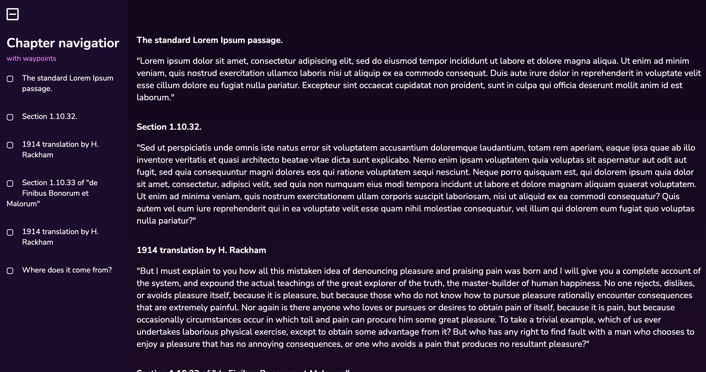

#Table of contents navigator

Navigator is kind of table of contents displayed as a sidebar. At the moment waypoints are not implemented (despite the screenshot) as I am looking for a way it can be done. There is one popular plugin available, but it requires jQuery and for a such small project like this one it's a bit overkill. 
Anyway, here you have main features:

- Fully responsive design,
- Automatically hides/shows when window is resized,
- Automatically generates chapters

How to use:
- copy all content from index.html between BODY tags,
- copy JS and CSS,
- to create chapter just use class="navigator-chapter" and id as a link. Check below:
```
 <p id="chapter-1" class="navigator-chapter">The standard Lorem Ipsum passage.</p>
 ```
 Navigator automatically generates content of the sidebar based on "navigator-chapter" class.

